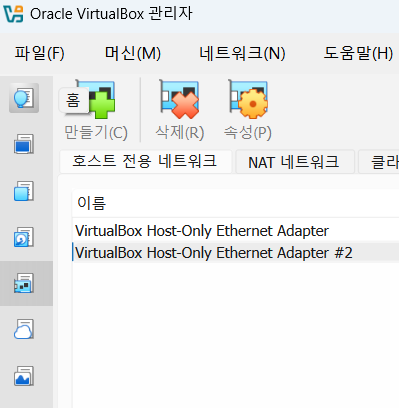
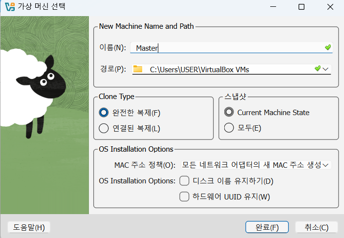
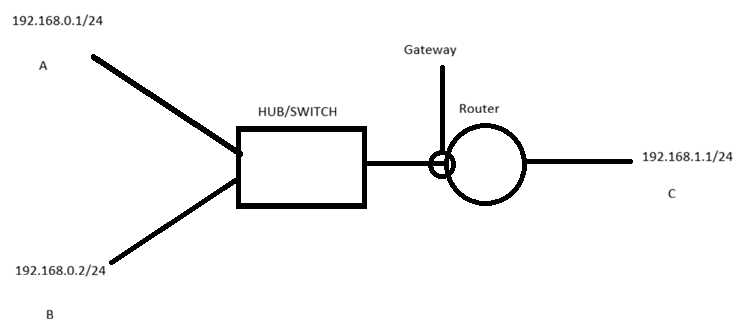

# 네트워크 설정

## ip 예제

1. 전체 조회
```bash
kingrange@kilwon:~$ ip address show
1: lo: <LOOPBACK,UP,LOWER_UP> mtu 65536 qdisc noqueue state UNKNOWN group default qlen 1000
    link/loopback 00:00:00:00:00:00 brd 00:00:00:00:00:00
    inet 127.0.0.1/8 scope host lo
       valid_lft forever preferred_lft forever
    inet6 ::1/128 scope host
       valid_lft forever preferred_lft forever
2: enp0s3: <BROADCAST,MULTICAST,UP,LOWER_UP> mtu 1500 qdisc fq_codel state UP group default qlen 1000
    link/ether 08:00:27:e7:d2:6a brd ff:ff:ff:ff:ff:ff
    inet 10.0.2.15/24 metric 100 brd 10.0.2.255 scope global dynamic enp0s3
       valid_lft 19642sec preferred_lft 19642sec
    inet 192.168.0.5/24 scope global enp0s3
       valid_lft forever preferred_lft forever
    inet6 fd17:625c:f037:2:a00:27ff:fee7:d26a/64 scope global dynamic mngtmpaddr noprefixroute
       valid_lft 86171sec preferred_lft 14171sec
    inet6 fe80::a00:27ff:fee7:d26a/64 scope link
       valid_lft forever preferred_lft forever
```

2. 특정 디바이스 확인
```bash
kingrange@kilwon:~$ ip address show enp0s3
2: enp0s3: <BROADCAST,MULTICAST,UP,LOWER_UP> mtu 1500 qdisc fq_codel state UP group default qlen 1000
    link/ether 08:00:27:e7:d2:6a brd ff:ff:ff:ff:ff:ff
    inet 10.0.2.15/24 metric 100 brd 10.0.2.255 scope global dynamic enp0s3
       valid_lft 19630sec preferred_lft 19630sec
    inet 192.168.0.5/24 scope global enp0s3
       valid_lft forever preferred_lft forever
    inet6 fd17:625c:f037:2:a00:27ff:fee7:d26a/64 scope global dynamic mngtmpaddr noprefixroute
       valid_lft 86159sec preferred_lft 14159sec
    inet6 fe80::a00:27ff:fee7:d26a/64 scope link
       valid_lft forever preferred_lft forever
```

3. ip 추가
```bash
kingrange@kilwon:~$ ip address show enp0s3
2: enp0s3: <BROADCAST,MULTICAST,UP,LOWER_UP> mtu 1500 qdisc fq_codel state UP group default qlen 1000
    link/ether 08:00:27:e7:d2:6a brd ff:ff:ff:ff:ff:ff
    inet 10.0.2.15/24 metric 100 brd 10.0.2.255 scope global dynamic enp0s3
       valid_lft 19611sec preferred_lft 19611sec
    inet 192.168.0.5/24 scope global enp0s3
       valid_lft forever preferred_lft forever
    inet 192.168.0.20/24 scope global secondary enp0s3 # 추가 잘 되었음
       valid_lft forever preferred_lft forever
    inet6 fd17:625c:f037:2:a00:27ff:fee7:d26a/64 scope global dynamic mngtmpaddr noprefixroute
       valid_lft 86140sec preferred_lft 14140sec
    inet6 fe80::a00:27ff:fee7:d26a/64 scope link
       valid_lft forever preferred_lft forever
```

4. ip 삭제
```bash
kingrange@kilwon:~$ sudo ip address del 192.168.0.20/24 dev enp0s3
kingrange@kilwon:~$ ip address show enp0s3 # 확인 없어졌음
2: enp0s3: <BROADCAST,MULTICAST,UP,LOWER_UP> mtu 1500 qdisc fq_codel state UP group default qlen 1000
    link/ether 08:00:27:e7:d2:6a brd ff:ff:ff:ff:ff:ff
    inet 10.0.2.15/24 metric 100 brd 10.0.2.255 scope global dynamic enp0s3
       valid_lft 19574sec preferred_lft 19574sec
    inet 192.168.0.5/24 scope global enp0s3
       valid_lft forever preferred_lft forever
    inet6 fd17:625c:f037:2:a00:27ff:fee7:d26a/64 scope global dynamic mngtmpaddr noprefixroute
       valid_lft 86103sec preferred_lft 14103sec
    inet6 fe80::a00:27ff:fee7:d26a/64 scope link
       valid_lft forever preferred_lft forever
```

## 라우팅 테이블과 게이트웨이 주소 관리 (ip- route 명령)
- `ip route명령`은 `Routing Table을 출력`하거나 `Gateway를 설정`하고 `삭제`
    - `Gateway`란?
        - 네트워크를 `다른 네트워크와 연결할 때`, `연결점`이 되는 장치
        - Gateway를 하나의 컴퓨터로도 볼 수 있다.
        - 보통 `Router`에 속해있다. (참고 참고)
        - 패킷을 보고 `동일한 네트워크`(`subnet mask`부분이 동일하면 동일 네트워크)`로 보내는 것이 아니면, 외부로 전달`한다
        - `Gateway가 없으면`, `동일 네트워크가 아닌 컴퓨터와 접속이 불가`하다.

### 기본 게이트웨이 설정
```bash
sudo ip route add default via [IP주소] dev [디바이스]
```
### 라우팅 경로 설정
- 대상 IP를 접속 통로 IP를 통해서 접속하도록 설정
```bash
sudo ip route add [대상 IP] via [접속 통로 IP] dev [디바이스]
```
### 라우팅 경로 삭제
```bash
sudo ip route del [삭제할 IP]
```
### 예시
1. 라우팅 테이블 출력
```bash
kingrange@kilwon:~$ ip route show
default via 10.0.2.2 dev enp0s3 proto dhcp src 10.0.2.15 metric 100
8.8.8.8 via 10.0.2.2 dev enp0s3 proto dhcp src 10.0.2.15 metric 100
10.0.2.0/24 dev enp0s3 proto kernel scope link src 10.0.2.15 metric 100
10.0.2.2 dev enp0s3 proto dhcp scope link src 10.0.2.15 metric 100
164.124.101.2 via 10.0.2.2 dev enp0s3 proto dhcp src 10.0.2.15 metric 100
192.168.0.0/24 dev enp0s3 proto kernel scope link src 192.168.0.5
```
- default : 기본 게이트 웨이 
    - via 10.0.2.2라고 되어 있으므로, 10.0.2.2가 기본 게이트 웨이라는 것을 알 수 있다.
- 10.0.2.0/24 : 서브넷 설정, 커널이 자동으로 설정한 것이다.

2. 기본 게이트웨이 설정
```bash
sudo ip route add default via 10.0.2.1 dev enp0s3
```

## `네트워크 인터페이스 관리 명령 (link 명령)`
- 거의 Hub/Switch에서 하지, PC에선 잘 안한다.
- 활성화
    ```bash
    sudo ip link set [디바이스] up
    ```
- 비활성화
    ```bash
    sudo ip link set [디바이스] down
    ```

## `주소 관리 명령 (ifconfig)`
- 최근엔 이보다 ip 명령어 사용하는 것을 권장한다.
- net-tools라는 패키지를 설치해야 사용 가능하다.
    ```bash
    sudo apt install net-tools
    ```
### 형식
```bash
ifconfig [-a] [-v] [-s] <interface> [옵션 값]
```
- 기본 옵션
    - `-a` : 활성화되지 않은 인터페이스를 포함하여 모든 인터페이스 출력
    - `-v` : 특정 오류 상황에 대해 정보를 더 자세히 출력
    - `-s` : 짧은 목록 형식, 인터페이스의 요약 통계만 출력

- <옵션 값> (<HW> : Hardware type ,<AF> : Address Family)
    - `[[<AF>] <address>]` : 
    - `[add/del <address>[/<prefixlen>]]` : 특정 주소에 IPv6주소를 추가하거나 삭제
    - `[[-]broadcast [<address>]]` : 브로드캐스트 주소 설정
    - `[[-]pointopoint [<address>]]` : 두 IP간 직접 연결 모드(PTP) 설정
    - `[netmask <address>]` : 서브넷마스크 주소 설정
    - `[dstaddr <address>]` 
    - `[tunnel <address>]` : 특정 목적지까지 터널링 설정
    - `[outfill <NN>]` 
    - `[keepalive <NN>]`
    - `[hw <HW> <address>]` : 인터페이스의 하드웨어 주소(MAC 주소)를 변경
    - `[mtu <NN>]` : 최대 전송 단위(mtu) 조절 (네트워크 효율을 위해 패킷의 최대 크기를 조절할 때 사용)
    - `[[-]trailers]` 
    - `[[-]arp]` : ARP(AddressResolutionProtocol) 사용 여부 결정, 앞에 [-]붙으면 비활성화
    - `[[-]allmulti]` : multicast 패킷 수신 여부 설정
    - `[multicast]` : 인터페이스의 멀티캐스트 플래그 설정
    - `[[-]promisc]` : Promiscuous 모드를 설정, 활성화시 해당 인터페이스로 들어오는 모든 패킷을 수신 (자신에게 오는 것이 아니어도), 네트워크 패킷 분석시 사용
    - `[mem_start <NN>]` : 장치가 사용하는 공유 메모리의 시작 주소 설정
    - `[io_addr <NN>]` : 장치의 I/O 시작 주소 설정
    - `[irq <NN>]` : 장치가 사용하는 인터럽트(IRQ) 번호 설정
    - `[media <type>]` 
    - `[txqueuelen <NN>]` : 장치의 전송 대기열(transmit queue) 길이 설정, 속도가 느리거나, 지연이 심한 HW에서 사용
    - `[[-]dynamic]` : 인터페이스의 Dynamic 플래그 설정
    - `[up|down]` : 인터페이스 활성화/비활성화

### 모든 인터페이스 확인
```bash
enp0s3: flags=4163<UP,BROADCAST,RUNNING,MULTICAST>  mtu 1500
        inet 10.0.2.15  netmask 255.255.255.0  broadcast 10.0.2.255 # IP, netmask, broadcast
        inet6 fe80::a00:27ff:fee7:d26a  prefixlen 64  scopeid 0x20<link> #IPv6 주소
        inet6 fd17:625c:f037:2:a00:27ff:fee7:d26a  prefixlen 64  scopeid 0x0<global>
        ether 08:00:27:e7:d2:6a  txqueuelen 1000  (Ethernet) # MAC주소
        RX packets 215220  bytes 238976958 (238.9 MB) # 부팅 후 받은 패킷 수, 바이트 수
        RX errors 0  dropped 0  overruns 0  frame 0
        TX packets 61383  bytes 6506121 (6.5 MB) # 부팅 후 보낸 패킷 수, 바이트 수
        TX errors 0  dropped 0 overruns 0  carrier 0  collisions 0
```

### 인터페이스 설정
```bash
sudo ifconfig <디바이스> <ip주소> netmask <subnet mask> broadcast <broadcast 주소>
```
## route 
- `게이트웨이를 설정`하는 명령
### 형식
```bash
route [명령]
```
- `add` : routing 경로/기본 Gateway 추가
- `del` : routing 경로/기본 Gateway 제거

### 예시
1. 라우팅 테이블 보기
    ```bash
    kingrange@kilwon:~$ route
    Kernel IP routing table
    Destination     Gateway         Genmask         Flags Metric Ref    Use Iface
    default         _gateway        0.0.0.0         UG    100    0        0 enp0s3
    dns.google      _gateway        255.255.255.255 UGH   100    0        0 enp0s3
    10.0.2.0        0.0.0.0         255.255.255.0   U     100    0        0 enp0s3
    _gateway        0.0.0.0         255.255.255.255 UH    100    0        0 enp0s3
    ns.dacom.co.kr  _gateway        255.255.255.255 UGH   100    0        0 enp0s3
    192.168.0.0     0.0.0.0         255.255.255.0   U     0      0        0 enp0s3
    ```
    - `Destination` : 목적지
    - `Gateway` : 게이트웨이
    - `Genmask` : 서브넷마스크
        - 255.255.255.255 : 호스트
        - 0.0.0.0 : default
    - `Metric` : 대상까지 거리
        - 이 값이 클 수록 먼 것
        - 현재 Linux에서 사용 안 함
    - `Ref` : 해당 경로에 대한 참조 수
        - 현재 Linux에서 사용 안 함
    - `Use` : 사용 여부
    - `Iface` : 인터페이스
2. 기본 게이트웨이 설정
    ```bash
    sudo route add default gw <게이트웨이 주소> dev <Interface 이름>
    ```
## DNS 설정
- `DNS(domain name service)`: 호스트의 이름을 IP 주소로 바꾸는 역할 수행
    - DNS가 없으면 name으로 서버에 접속할 수 없고, IP 주소로 접속해야 한다.
- 17.04버전부터 DNS 관리하는 systemd-resolved 서비스 도입
    - `/etc/resolv.conf` 파일에 저장되어 있다.
### 확인
```bash
kingrange@kilwon:~$ cat /etc/resolv.conf
...(생략)
nameserver 127.0.0.53 # 실제 DNS 주소는 아니다. 로컬 스터브 주소를 가리키는 심볼릭 링크
options edns0 trust-ad
search .

kingrange@kilwon:~$ resolvectl status # 실제 DNS 주소 확인
Global
       Protocols: -LLMNR -mDNS -DNSOverTLS DNSSEC=no/unsupported
resolv.conf mode: stub

Link 2 (enp0s3)
    Current Scopes: DNS
         Protocols: +DefaultRoute +LLMNR -mDNS -DNSOverTLS DNSSEC=no/unsupported
Current DNS Server: 164.124.101.2
       DNS Servers: 164.124.101.2 8.8.8.8 fd17:625c:f037:2::3
```

## nslookup

```bash
nmcli con mod <인터페이스 이름> ipv4.dns <DNS 주소>
```
- DNS 질의 명령 : nslookup
    ```bash
    kingrange@kilwon:~$ nslookup
    > www.google.com
    Server:         127.0.0.53
    Address:        127.0.0.53#53

    Non-authoritative answer:
    Name:   www.google.com
    Address: 142.250.197.4
    Name:   www.google.com
    Address: 2404:6800:4005:822::2004
    ```

## netplan
- 우분투에서 `네트워크 구성`을 관리하는 도구 중 하나
- 네트워크 구성을 설정 파일을 이용해서 작업
    - 파일에 직접 기록하는 것이므로, ip와 다르게 재부팅해도 사라지지 않는다.
- `/etc/netplan` 디렉토리에 YAML 파일을 만들어주면 된다.
    - `YAML` : 데이터 직렬화 양식
        - 데이터를 텍스트로 표현하기 위한 방법
        - 사람이 읽기 쉽고 쓰기 편하게 설계된 방식
        - 설정 파일, 데이터 저장, 시스템 간 데이터 교환(도커, 쿠버네티스, 스프링 등) 등에 널리 사용된다.
        - JSON이나 XML 보다 문장 구조 단순
        - 공백을 이용하여 계층 구조 정의
        - 주석 (#) 지원
        - 상위 호환성 (모든 JSON은 yaml 파일로 해석 가능)
        - 확장자 : yaml,yml
    - 파일 이름 상관 X
### 인터페이스 설정
```bash
sudo vim /etc/netplan/01-netcfg.yaml

network:
    version: 2
    renderer: networkd
    ethernets:
        enp0s3:
            dhcp4: no
            addresses: [DNS 서버 주소 나열]
```
# Host Name 설정
## uname
- 호스트 이름 출력
### 형식
```bash
uname [옵션]
```
- 옵션
    `-a`, `--all`                print all information, in the following order, except omit -p and -i if unknown:
    `-s`, `--kernel-name`        print the kernel name
    `-n`, `--nodename`           print the network node hostname
    `-r`, `--kernel-release`     print the kernel release
    `-v`, `--kernel-version`     print the kernel version
    `-m`, `--machine`            print the machine hardware name
    `-p`, `--processor`          print the processor type (non-portable)
    `-i`, `--hardware-platform`  print the hardware platform (non-portable)
    `-o`, `--operating-system`   print the operating system
      --help     display this help and exit
      --version  output version information and exit
## hostname
- `시스템의 네트워크 이름을 확인`하거나 `일시적으로 변경`하고자 할 때 사용한다.
### 형식
```bash
hostname [-b] {hostname|-F file}         set host name (from file)
hostname [-a|-A|-d|-f|-i|-I|-s|-y]       display formatted name
hostname                                 display host name
hostname -V|--version|-h|--help          print info and exit
```
- 옵션
    - `-a`, `--alias`           : alias names
    - `-A`, `--all-fqdns`       : all long host names (FQDNs)
    - `-b`, `--boot`            : set default hostname if none available
    - `-d`, `--domain`          : DNS domain name
    - `-f`, `--fqdn`, `--long`  : long host name (FQDN)
    - `-F`, `--file`            : read host name or NIS domain name from given file
    - `-i`, `--ip-address`      : addresses for the host name
    - `-I`, `--all-ip-addresses`: all addresses for the host
    - `-s`, `--short`           : short host name
    - `-y`, `--yp`, `--nis`     : NIS/YP domain name

### 예시
1. `이름 변경` (현재 세션에서만 적용)
    ```bash
    kingrange@kilwon:~$ hostname
    kilwon
    kingrange@kilwon:~$ sudo hostname kingrange
    [sudo] password for kingrange:
    kingrange@kilwon:~$ hostname
    kingrange
    ```
## hostnamectl
- 현재는 hostname보다 이것을 권장한다.
- `호스트 이름을 확인하고 설정`하는 명령
### 형식
```bash
hostnamectl [OPTIONS...] COMMAND ...
```
- 옵션
    - `--help` : Show this help
    - `--version` : Show package version
    - `--no-ask-password` : Do not prompt for password
    - `--host=[USER@]HOST` : Operate on remote host
    - `--machine=CONTAINER` : Operate on local container
    - `--transient` : Only set transient hostname
    - `--static` : Only set static hostname
    - `--pretty` : Only set pretty hostname
    - `--json=pretty|short|` : off Generate JSON output

- COMMAND
    - `status`                 : Show current hostname settings
    - `hostname [NAME]`   : Get/set system hostname
    - `icon-name [NAME]`  : Get/set icon name for host
    - `chassis [NAME]`    : Get/set chassis type for host
    - `deployment [NAME]` : Get/set deployment environment for host 
    - `location [NAME]`   : Get/set location for host

### 예시
1. `host 이름 출력`
    ```bash
    kingrange@kilwon:~$ hostnamectl
    Static hostname: kilwon
    Transient hostname: kingrange
            Icon name: computer-vm
            Chassis: vm
            Machine ID: b043b6ac31794094842c47d6a71e6c00
            Boot ID: b551f94ba69b465681b95cc82f85120d
        Virtualization: oracle
    Operating System: Ubuntu 22.04.5 LTS
                Kernel: Linux 5.15.0-164-generic
        Architecture: x86-64
    Hardware Vendor: innotek GmbH
        Hardware Model: VirtualBox
    ```

2. `hostname 변경`
    ```bash
    kingrange@kilwon:~$ sudo hostnamectl set-hostname kingrang2
    kingrange@kilwon:~$ hostnamectl
    Static hostname: kingrang2
        Icon name: computer-vm
            Chassis: vm
        Machine ID: b043b6ac31794094842c47d6a71e6c00
            Boot ID: b551f94ba69b465681b95cc82f85120d
    Virtualization: oracle
    Operating System: Ubuntu 22.04.5 LTS
            Kernel: Linux 5.15.0-164-generic
        Architecture: x86-64
    Hardware Vendor: innotek GmbH
    Hardware Model: VirtualBox
    ```

## /etc/hosts 파일
- `도메인 이름`을 `IP주소로 매핑`하는 `Local DNS 파일`
    - DNS 조회를 거치지 않고, `특정 호스트 이름을 IP주소로 변환하는데 사용`되며, 주로 `로컬 시스템에서 가장 먼저 참조하는 파일`
        - ex, 127.0.0.1 kingrange.com으로 설정되어 있으면 kingrange.com 입력시 127.0.0.1로 이동
- 용도
    1. `로컬 호스트 및 개발` : 웹 사이트 개발 시, 아직 도메인에 연결되지 않은 개발 서버 IP 주소로 특정 도메인 이름을 매핑하여, 로컬에서 테스트
    2. `시스템 최적화` : 자주 방문하는 호스트 이름을 DNS 조회 고정을 생략하여 약간의 속도 향상 기대
    3. `특정 사이트 차단` : 악성 사이트, 광고 서버의 도메인 이름을 루프백 주소에 매핑하여 접속 차단하는데 사용
    4. `자체 호스트 이름 정의` : 로컬 네트워크 환경에서 서버, 장치들의 이름을 편리하게 지정하고 접근하는데 사용
### 형식
- IP주소(공백)호스트이름 [별칭1,별칭2,...]
    ```bash
    kingrange@kilwon:~$ cat /etc/hosts
    127.0.0.1 localhost
    127.0.1.1 kilwon

    # The following lines are desirable for IPv6 capable hosts
    ::1     ip6-localhost ip6-loopback
    fe00::0 ip6-localnet
    ff00::0 ip6-mcastprefix
    ff02::1 ip6-allnodes
    ff02::2 ip6-allrouters
    ```

### 작성 시 주의사항
- 0.0.0.0 접속 대상 IP가 아니기 때문에 연결 되지 않는다.
    - 특정 도메인을 차단하는 경우에도 0.0.0.0으로 설정하면 된다.

### 수정 후 체크 사항
- `DNS 캐시 삭제`
    - LINUX : `sudo systemctl restart systemd-resolved`
    - Window : `ipconfig /flushdns`
    - Mac :
        1. `sudo dscacheutil -flushcache`
        2. `sudo killall -HUP mDNSResponder`
### 호스트와 DNS 우선 순위
1. hosts 파일
2. DNS 캐시
3. DNS 서버 

### 운영하는 서버에서 hosts 사용을 피해야 하는 이유
1. DNS 변경이 반영되지 않을 수 있다.
    - `상황`
        1. DNS에서 서버 IP
        2. 일부 서버만 계속 예전 IP로 접속
    - `원인`
        - ex, hosts파일에 `10.0.0.5 api.example.com` 이라 기재
            - DNS는 바뀌었지만, hosts가 우선
            - 서버마다 서로 다른 목적지로 접속
    - `결과` 
        - 서버간 통신 장애
        - 특정 서버에서만 장애 발생

2. 서버마다 설정이 달라짐 (`일관성 붕괴`)
    - 서버 A에는 hosts가 존재 / 서버 B에는 hosts가 없는 경우

3. 장애 발생 시 `원인 추적이 극도로 어려움`
    - SSH/API/DB의 간헐적 실패
    - 로그 상 네트워크 문제로 보임

4. `서버 교체` 또는 `AutoScailing과 충돌`
    - 클라우드 환경에서 문제
        - Auto Scaling
        - Immutable Infrastructure
        - Blue-Green 배포
    - 문제
        - 새 서버엔 hosts가 없음
        - 기존 서버만 정상 동작
        - 배포 직후 일부 서버만 장애
5. `보안 사고 위험`
    - 내부자 공격, 침해 시 피해가 증폭된다.

6. `운영 자동화 도구와도 충돌`된다.
    - 충돌 대상
        - Ansible
        - Terraform
        - Kubernetes
        - CI/CD 파이프라인
    - 문제
        - `인프라 도구는 DNS 기준으로 설정`
        - hosts는 `로컬 수동 설정`
### hosts 변경하는 경우
1. local 개발 PC
2. 개인 test server
3. 단기 장애 우회

### IP 주소를 찾는 과정
1. URL 입력
2. `/etc/host.conf` 조회(hosts 파일의 위치를 조회)
3. `/etc/hosts/` 조회 
4. `hosts에 IP주소가 있`는 경우
    - hosts에서 IP 주소 획득
5. `hosts에 IP주소가 없`는 경우
    - `/etc/resolv.conf`를 조회하여 DNS server 설정 확인
6. `DNS Server 설정이 없`는 경우
    - 호스트 이름을 알 수 없음
7. `DNS server 설정이 있`는 경우
    - DNS server에 질의하여 IP 주소 획득

## net stats
- 네트워크 연결 상태, 라우팅 테이블, 인터페이스 관련 통계 등을 출력하고 현재 시스템에 열려있는 포트가 무엇인지도 확인할 수 있는 명령

### 형식
```bash
netstat [옵션]
```
- 옵션
    1. `-a` : 모든 소켓 정보 출력
    2. `-r` : 라우팅 정보 출력
    3. `-n` : 호스트 이름 대신 IP 주소로 출력
    4. `-i` : 모든 네트워크 Interface 정보 출력
    5. `-s` : 프로토콜 별로 네트워크 통계 정보 출력
    6. `-p` : 해당 소켓과 관련된 프로세스 이름과 PID를 출력
- 열려있는 포트 확인
    ```bash
    netstat -an | grep LISTEN
    tcp        0      0 0.0.0.0:22              0.0.0.0:*               LISTEN
     # tcp 사용 / 수신 대기 큐 0 / 아직 처리되지 않은 패킷 0개 / 로컬 컴퓨터 주소 0.0.0.0.0:22 / 원격 컴퓨터 주소 : 0.0.0.0:* / 현재 상태(LISTEN 통신 가능)
    tcp        0      0 127.0.0.53:53           0.0.0.0:*               LISTEN
    tcp6       0      0 :::22                   :::*                    LISTEN
    unix  2      [ ACC ]     STREAM     LISTENING     18503    /run/systemd/private
     # unix 소켓 상태 해석
     # 열려있는 포트를 사용 중인 프로세스 확인 : netstat -p
     # 
    unix  2      [ ACC ]     STREAM     LISTENING     18505    /run/systemd/userdb/io.systemd.DynamicUser
    ...(생략)
    ```
## ARP(Address Resolution Protocol)
- `MAC Address`와 `IP` 확인
- 동일한 네트워크에 연결된 시스템들의 MAC Address와 IP 주소를 확인하는 명령
### 형식
```bash
arp [IP 주소]
```

## tcpdump
- 패킷 캡처 명령
### 형식
```bash
tcp [옵션]
```
- 옵션
    - `-c 패킷수` : 개수만큼 덤프받고 종료
    - `-i 인터페이스` : 인터페이스 지정
    - `-n` : IP 주소를 호스트 이름으로 변경하지 않음
    - `-q` : 정보를 간단하게 출력
    - `-X` : 패킷의 내용을 16진수로 출력
    - `-w 파일명` : 파일에 기록
    - `-r 파일명` : 파일에서 읽음
    - `--host` : 지정한 호스트가 보낸 패킷만 dump
    - `--tcp 포트번호` : 지정한 포트번호 패킷만 dump
    - `--ip` : IP 패킷만 dump

# network 상태 확인
## ping
- `외부와 통신되는지 확인`하거나 `외부 서버가 동작하는지 확인할 때 사용`한다.
    - 보안을 위해 ping이 왔을 때, 응답하지 않도록 설정하는 경우도 있기에 ping 응답이 없다고, 해당 시스템이 동작하지 않는다고 단정할 수는 없다.
### 형식
```bash
ping [options] <destination>
```
- 옵션
  - \<destination\>     : dns name or ip address
  - `-a`                : use audible ping
  - `-A`                : use adaptive ping
  - `-B`                : sticky source address
  - `-c` \<count>       : stop after \<count> replies
  - `-D`                : print timestamps
  - `-d`                : use SO_DEBUG socket option
  - `-f`                : flood ping
  - `-h`                : print help and exit
  - `-I` \<interface>   : either interface name or address
  - `-i` \<interval>    : seconds between sending each packet
  - `-L`                : suppress loopback of multicast packets
  - `-l` \<preload>     : send \<preload> number of packages while waiting replies
  - `-m` \<mark>        : tag the packets going out
  - `-M` \<pmtud opt>   : define mtu discovery, can be one of \<do|dont|want>
  - `-n`                : no dns name resolution
  - `-O`                : report outstanding replies
  - `-p` \<pattern>     : contents of padding byte
  - `-q`                : quiet output
  - `-Q` \<tclass>      : use quality of service \<tclass> bits
  - `-s` \<size>        : use \<size> as number of data bytes to be sent
  - `-S` \<size>        : use \<size> as SO_SNDBUF socket option value
  - `-t` \<ttl>         : define time to live
  - `-U`                : print user-to-user latency
  - `-v`                : verbose output
  - `-V`                : print version and exit
  - `-w` \<deadline>    : reply wait \<deadline> in seconds
  - `-W` \<timeout>     : time to wait for response    
### 예시
1. 패킷 수를 지정해서 사용
    ```bash
    kingrange@kilwon:~$ ping -c 5 www.google.com
    PING www.google.com (142.250.197.100) 56(84) bytes of data.
    64 bytes from nchkga-ai-in-f4.1e100.net (142.250.197.100): icmp_seq=1 ttl=255 time=62.9 ms
    64 bytes from nchkga-ai-in-f4.1e100.net (142.250.197.100): icmp_seq=2 ttl=255 time=63.7 ms
    64 bytes from nchkga-ai-in-f4.1e100.net (142.250.197.100): icmp_seq=3 ttl=255 time=64.1 ms
    64 bytes from nchkga-ai-in-f4.1e100.net (142.250.197.100): icmp_seq=4 ttl=255 time=61.1 ms
    64 bytes from nchkga-ai-in-f4.1e100.net (142.250.197.100): icmp_seq=5 ttl=255 time=62.0 ms

    --- www.google.com ping statistics ---
    5 packets transmitted, 5 received, 0% packet loss, time 4008ms
    rtt min/avg/max/mdev = 61.102/62.768/64.144/1.109 ms
    ```
    - 해석
        1. 64 bytes from nchkga-ai-in-f4.1e100.net (142.250.197.100)
            - 패킷의 크기와 목적지 IP
        2. icmp_seq=1
            - 응답이 보낸 ICMP 패킷의 순서
        3. ttl=255 
            - Time to live
            - 패킷이 목적지까지 도달하는데 거친 라우터의 수
                - 처음 출발할 때 설정된 값에서 라우터를 거칠 때마다 1씩 감소
                - 이 값이 짧을수록 경로가 짧거나, 안정적이다.
        4. time=62.9 ms
            - 왕복 시간, 패킷이 출발지에서 목적지까지 갔다가 돌아오는데 걸린 시간
        5. 5 packets transmitted, 5 received, 0% packet loss, time 4008ms
            - 5개 패킷 전송, 5개 수신, 0% 손실률, 총 시간
        6. rtt min/avg/max/mdev = 61.102/62.768/64.144/1.109 ms
            - 가장 빨랐던 왕복 시간 /평균 왕복 / 오래걸린 왕복 / 표준 편차

# Virtual Box에서 하나의 네트워크에 묶인 컴퓨터 만들기
- 이제 필요한 만큼 컴퓨터를 네트워크에 만들 수 있다.

1. Virtual Box Network -> Network-> NAT 네트워크 -> 만들기
    
9. 네트워크 편입 시키기
    - 가상머신 선택 -> 설정 -> 네트워크
        - Attach to를 NAT 네트워크로 변경하고 아래에서 이름 선택
2. 생성된 네트워크 선택 후, 일반 옵션 선택
3. 이름 수정, 네트워크 IP 대역 설정(ex,10.0.2.0/24), DHCP 활성화 해제(IP 수정을 위해)
4. 필요한 만큼 가상머신 생성
    - Machine Menu -> 머신 -> 복제
        
5. 컴퓨터 하나의 인터페이스 확인 및 IP 설정
    1. 부팅
    2. `sudo nano /etc/netplan/00-installer-config.yaml`
    3. 입력
        ```yaml
        network:
            version: 2
            renderer: networkd
            ethernets:
                enp0s3:
                    dhcp4: false
                    addresses: 
                        - 10.0.2.101/24
                    routes:
                        - to: default
                          via: 10.0.2.1
                    nameservers:
                        addresses: [8.8.8.8, 1.1.1.1]
        ```
    4. 권한 보호
        ```bash
        sudo chmod 600 /etc/netplan/00-installer-config.yaml
        ```
6. 적용
    ```bash
    sudo netplan apply
    ```
7. 확인
    ```bash
    ip address show
    ```
8. 호스트 이름 변경
    ```bash
    sudo hostnamectl set-hostname master
    cat /etc/hostname
    ```
9. /etc/hosts 설정
    ```bash
    sudo nano /etc/hosts
    127.0.1.1 변경한 자신의 이름

    10.0.2.101 master #다른 네트워크의 이름
    10.0.2.102 worker1 #다른 네트워크의 이름
    ```

# 실습 - 3개의 Linux 가상 머신 만들고 하나의 네트워크로 묶기
- 조건
    1. ping 명령으로 컴퓨터들이 통신이 되는지 확인
    2. hostname으로도 ping이 가능한지 확인

- 성공!

## 네트워크 용어 이해

1. `Routing Table`
    - Router가 `데이터 패킷을 어디로 보낼지 참조`하는 테이블
        - `Router` : `서로 다른 네트워크를 연결`한다.
            - 역할
                1. `서로 다른 네트워크` 간 `데이터 전송`
                2. 빠르고 효율적인 `경로를 선택`(`Routing`)한다.
    - `Route 추가 방법`
        1. Router에 `직접 케이블 연결` 후, IP 입력
        2. `정적 Routing`
            - 관리자가 직접 명령어로 Route를 입력
        3. `동적 Routing`
            - Router끼리 서로 아는 길을 공유하며, 자동으로 Table 생성
    - `기본 경로`
        - `Rouing Table에 정보가 없을 때 선택`하는 경로
        - `단계`  
            1. Routing Table에서 `목적지 IP와 가장 길게 일치하는 경로 찾음`
            2. 전혀 `없다면`, `0.0.0.0`으로 기본 경로 이동
            3. 기본 경로에 지정된 `Next Hop IP 주소` 또는 `나가는 포트`로 `패킷을 그냥 전달` (거기서 경로 찾아 처리하도록)
        - 이 `기본 경로도 없다면`, 패킷을 그냥 버리고, `Destination Unreachable 에러` 띄움

2. `Hub | Switch 차이`
    - `Hub` : 아주 단순한 장치
        - 들어온 내용을 `모든 연결된 기기에 전송`
            - 즉, 위 이미지에서 A가 라우터로 데이터를 보내면, B와 C로 모두 전달된다.
        - 특징
            1. `Broadcast` : `목적지와 관계없이 무조건 Broadcast`한다.
            2. `Collision` : 여러 기기가 동시에 데이터를 보내면, `충돌이 자주 발생해, 네트워크가 느려진다.`
            3. `보안 취약` : `모든 기기로 전송`되므로, `보안에 취약`하다.

    - `Swtich` : 데이터의 목적지를 확인해 `필요한 곳으로만 데이터 전달`
        - 특징
            1. `MAC Address Table` : `Mac 주소를 저장하는 테이블`을 가진다.
                - 해당 Table의 Mac 주소를 이용해 특정 기기로 데이터를 전송한다.
            2. `효율` : `각 기기에 독립적 통로를 제공`하고, `데이터 충돌을 방지`하므로 허브보다 훨씬 빠르다.
            3. `보안 우수` : 목적지가 아닌 기기에는 데이터가 가지 않기에 보안에 좋다.

3. Gateway의 역할
    - 한 네트워크에서 다른 네트워크로 나가기 위해 거쳐야 하는 지점
        - 보통 Router가 Gateway의 역할을 수행한다.
    - 서로 다른 네트워크가 다른 Protocol을 사용한다면, Gateway가 데이터를 이해할 수 있는 형식으로 변환해준다.

## 설정 파일
1. `properties` 
    - 속성 : 값 형식으로 저장
    - 계층 구조가 없어서 일관성이 없음
2. `XML(plist)`
    - 데이터를 태그를 이용하여 표현한다.
        ```xml
        <server>
            <name>...</name>
        </server>
        ```
    - 사이즈 너무 크고, 파싱하는데 구조 복잡, 중복 가능
3. `json(JavaScript Object Notation)`
    - js(파이썬) 객체 표현법으로 데이터 표현 
        ```json
        {
            "server" :
                {
                "name":~~~,
                "port":~~~
                }
        }
        ```
    - 중복 가능
4. `yaml`
    - 중복 불가
        ```yaml
        server : 
            name : ~,
            port : ~
        ```
## DCHP
- `동적 호스트 설정`
- Client가 접속할 때 `IP Pool에서 IP를 할당`해주는 서비스
- 장점
    - 직접 IP 설정 시, 관리자가 `IP 중복을 고려하며 할당해야하는 문제를 해결`
- 단점
    - `부팅마다 IP가 변경`된다.
